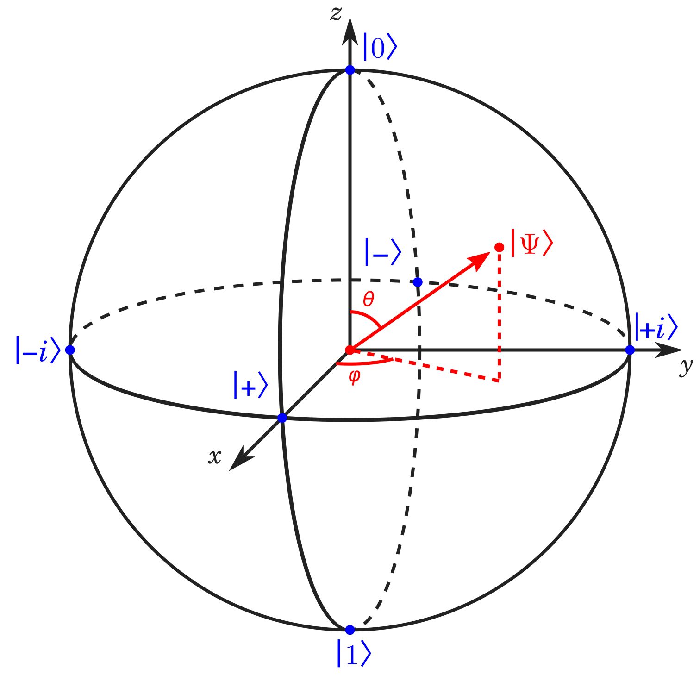

# Workshop 1 
## Review: 
- Classical Information is encoded in bits (0s and 1s). In the actual computer, this is done with transistors (0 is represented by a voltage drop). 
- Quantum Information has three new properties 
    - Superposition --> instead of the the transistors, quantum particles are used
    - Interference 
    - Entanglement --> Ex: 2 qubits are in a superposition and they are entangled. This results in correlations between measuring the state of the qubit. 
- Bloch Sphere

